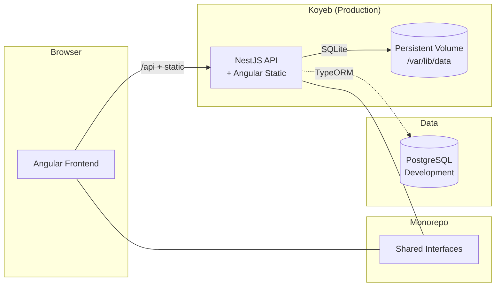

# Loan System Workspace

<a alt="Nx logo" href="https://nx.dev" target="_blank" rel="noreferrer"></a>

[](https://nx.dev)
[](https://angular.dev)
[](https://nestjs.com)
[](https://www.typescriptlang.org)
[](https://www.docker.com)
[](https://annoyed-magdaia-gfservicos-2b87a1c1.koyeb.app/)

A loan management system built as an Nx monorepo with Angular and NestJS. The project emphasizes clean domain boundaries, shared contracts, and a production-ready deployment flow using a single container.

## Highlights
- Client and loan management with financial calculations
- Dashboard metrics and consolidated overview
- Standalone Angular components with Tailwind CSS and pt-BR locale
- NestJS API with TypeORM, environment validation, and health checks
- Shared interfaces library for frontend-backend contracts
- Multi-stage Docker build, frontend served by backend in production

## Live Demo
- https://annoyed-magdaia-gfservicos-2b87a1c1.koyeb.app/

## Tech Stack
- **Frontend**: Angular 21, RxJS, Tailwind CSS
- **Backend**: NestJS 11, TypeORM
- **Database**: SQLite (production default), PostgreSQL (development)
- **Monorepo**: Nx 22
- **Testing**: Jest, Playwright
- **Containerization**: Docker

## Monorepo Structure
```
apps/
├── frontend/          # Angular application
├── frontend-e2e/      # Frontend E2E tests
├── backend/           # NestJS API
└── backend-e2e/       # Backend E2E tests

libs/
└── interfaces/        # Shared TypeScript interfaces
```

## Architecture


## Environment Configuration
Environment files are loaded from `infrastructure/environments/.env.<NODE_ENV>` and `infrastructure/environments/.env`. These files are gitignored. Use `infrastructure/environments/.env.example` as a template.

### Production (Koyeb / SQLite)
```
NODE_ENV=production
PORT=8080
DATABASE_TYPE=sqlite
DATABASE_PATH=/var/lib/data/data.db
DATABASE_SYNCHRONIZE=true
```

Attach a persistent volume to `/var/lib/data`. Use `DATABASE_SYNCHRONIZE=true` only for the initial deployment.

### Development (PostgreSQL via Docker)
```
NODE_ENV=development
PORT=3000
DATABASE_TYPE=postgres
DATABASE_HOST=localhost
DATABASE_PORT=5433
DATABASE_USER=postgres
DATABASE_PASSWORD=postgres
DATABASE_NAME=loan-system
DATABASE_SSL=false
```

## Local Development
1. Install dependencies:
```bash
npm install
```

2. Create `infrastructure/environments/.env.development` using the development template above.

3. Start PostgreSQL:
```bash
docker-compose -f infrastructure/docker/docker-compose.yml up postgres -d
```

4. Run the apps:
```bash
# Start frontend and backend simultaneously
npx nx serve frontend

# Or start only the backend
npx nx serve backend
```

The Angular dev server proxies `/api` to `http://localhost:3000`.

## Production Build
```bash
npx nx build frontend
npx nx build backend
npx nx run-many -t build
```

## Deployment (Docker / Koyeb)
1. Build the image:
```bash
docker build -t loan-system .
```

2. Run locally:
```bash
docker run -p 8080:8080 \
  -e PORT=8080 \
  -e DATABASE_TYPE=sqlite \
  -e DATABASE_PATH=/var/lib/data/data.db \
  -e DATABASE_SYNCHRONIZE=true \
  loan-system
```

3. On Koyeb, set the same environment variables and attach a volume to `/var/lib/data`.

## API
- Base path: `/api`
- Health check: `/api/health`

## Testing
```bash
npx nx run-many -t test
npx nx test frontend
npx nx test backend
npx nx test interfaces
npx nx e2e frontend-e2e
npx nx e2e backend-e2e
```

## Linting
```bash
npx nx run-many -t lint
npx nx lint frontend
npx nx lint backend
```

## Useful Nx Commands
```bash
npx nx graph
npx nx show project frontend
npx nx show projects
npx nx g @nx/angular:component my-component --project=frontend
```

## Data Model
- **Client**: CPF/CNPJ, income, and profile data
- **Loan**: Amount, rate, term, schedule, and status

## Ports
- **Frontend (dev)**: http://localhost:4200
- **Backend (dev)**: http://localhost:3000 (configurable via `PORT`)
- **Backend (prod)**: http://localhost:8080 (configurable via `PORT`)
- **PostgreSQL (dev)**: localhost:5433

## License
MIT
